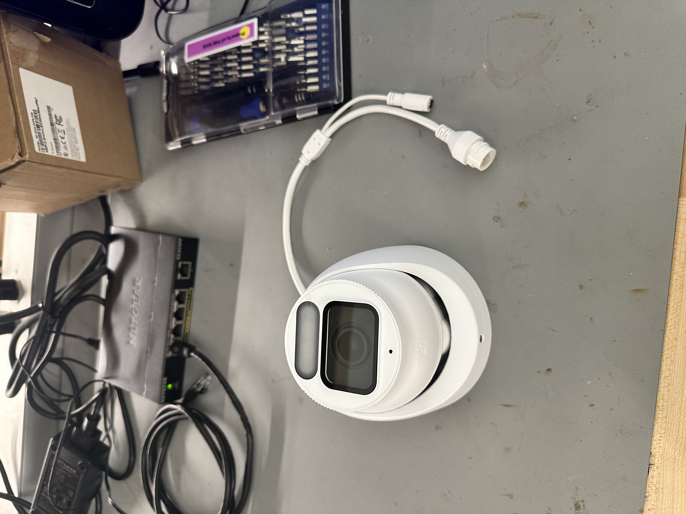
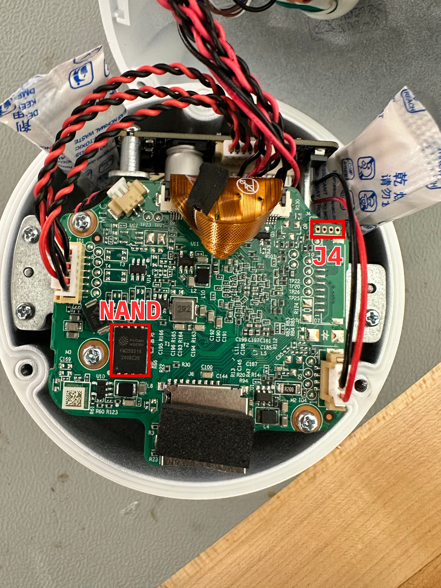
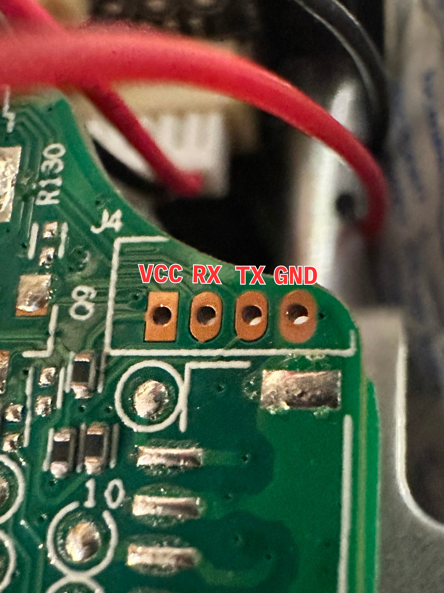
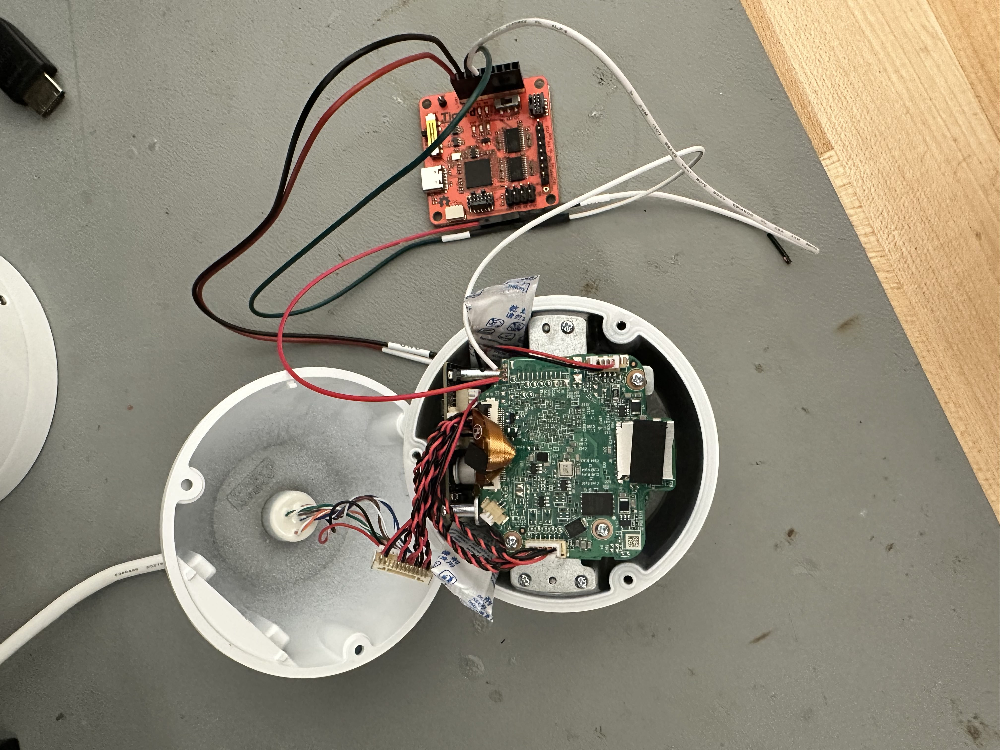

There's a gap between solving CTF challenges and poking at a real device running unknown firmware.

I bought a Uniview SC3243 security camera off eBay to find out how wide that gap really is.



With the camera in hand, the first step was opening it up.

## Hardware Enumeration

Removing three screws and popping open the enclosure revealed a small PCB with a NAND flash chip:



But the thing that immediately stood out to me was the unpopulated 4-pin header in the corner labeled J4.
Unpopulated headers on embedded hardware are usually there for good reason, whether that's debugging, manufacturing, or both.

The next step was probing each pin with a multimeter to map the pinout.

## Mapping the Pinout

The easiest thing to identify is a ground pin, so I started there.
I placed the ground probe on some metal plating in the camera, and poked each of the four headers with the positive probe. After reaching the outermost pin, the multimeter read 0, so I knew I'd found it. In the process of finding GND, I also uncovered another important detail: the pins were using a 3.3v logic level.
This hinted heavily at UART, which is a great sign.

Next, I needed to figure out which pin was transmitting data.
Assuming the TX pin would have something to output on bootup, I rebooted the device and observed the behavior of the remaining 3 pins.
I noticed that one of them was fluctuating in voltage when the camera turned on, while the others seemed relatively constant around 3.3v.
That's our TX.
The remaining two were suspected RX and VCC pins. Identifying these was a bit less scientific since both consistently sat around 3.3V. After trying both I got the final pinout identified in the picture below.



## Serial Access

With the pinout identified, I hooked up my Tigard to the pins using some stripped jumper cables (because PCBite probes are not cheap) and set the level shifter to 3.3v.



I used the following command to open up a serial console and connect to the Tigard with the most common UART baud rate (115200):

```
 picocom -b 115200 /dev/tty.usbserial-TG11171a0
```

Immediately after powering the camera on, I was greeted with boot logs:

```
U-Boot 2020.04-00011-gddf6f040-dirty (Jun 17 2024 - 18:12:02 +0800), Build: jenkins-Compile_64位(10.188.40.119)-7385
U-Boot code: 5C000400 -> 5C095BEC BSS: -> 5C0BD52C
Model: AXERA AX620E_Qnand Board
<...>
```

Seeing a bootloader banner is always a good sign.

One thing that immediately caught my eye, before the logs started flashing faster than the eye can see, was this line:

```
Press Ctrl+B to abort autoboot in 2 seconds
```

I took note of that and let the camera continue to boot normally.

Once it was done, I was prompted to enter a password.

```
root login:
```

I typed in "root", hit enter, and then boom!

Nothing happened...

After about an hour of confusion and thinking that picocom was the problem, I realized I'd forgotten to hook up GND...
Woops!

Anyways, after everything was _properly_ connected, I let the camera boot normally and tried logging in as root again.

I didn't find default credentials online, but after cycling through the usual suspects (`123456`, `admin`, `password`), I tried `uniview` on a whim and it worked!

After logging in I was dropped into this:

```
User@/root> help
    logout
    exit
    update
    systemreport.sh
    display
    ifconfig
    ping
    _hide
    sdformat
    resetconfig
    killall
    date
    catmwarestate
    catfpn
    <...>
    download_logo
    cleancfg
    iperf
    downloadsetup
    ls
    ps
    checksysready
    cleanlogo
    downloadlensinfo
    displaylensinfo
    clearlensinfo
    downstitchcal
    uploadstitchcal
    setmonocularid
    getudid
    route
    mountnfs
    secureboot
```

A restricted shell. The vendor whitelisted a small set of commands and locked everything else out.
This didn't seem useful at first, but I noticed a few of those commands had `.sh` extensions, which meant they were scripts sitting somewhere on the filesystem.

I took note of that and rebooted again to go dig deeper.

On this second reboot, I was able to interrupt the autoboot process and was greeted with this prompt:

```
uboot #
```

Now, I could start interacting with the device a little more, albeit still in a restricted capacity.

## Investigating the U-Boot Shell

The first thing I wanted to know was what I was working with, so I ran `help`:

```
uboot # help
?         - alias for 'help'
adc       - ADC sub-system
axera_boot- axera boot
axera_ota - ota from tftp server
base      - print or set address offset
bdinfo    - print Board Info structure
bind      - Bind a device to a driver
blkcache  - block cache diagnostics and control
boot      - boot default, i.e., run 'bootcmd'
<...>
printenv  - print environment variables
protect   - enable or disable FLASH write protection
pwm       - pwm config
random    - fill memory with random pattern
reset     - Perform RESET of the CPU
run       - run commands in an environment variable
saveenv   - save environment variables to persistent storage
sd_update - download mode
setenv    - set environment variable
<...>
```

There were quite a few interesting commands, but a few stood out to me immediately. `printenv`, `setenv`, and `saveenv` seemed like they could be very useful.

I started by running `printenv` to see if there were any environment variables that I might be able to manipulate:

```
uboot # printenv
baudrate=115200
bootargs=mem=107M console=ttyS0,115200n8 loglevel=8 earlycon=uart8250,mmio32,0x4880000 board_id=0,boot_reason=0x0 root=/dev/axramdisk rw rootfstype=ext2 init=/linuxrc mtdparts=spi4.0:1M(spl),512K(ddrinit),2048K(uboot),512K(env),6M(calibration),1M(cliinfo),8M(config),1M(runtime),6M(cfgbak),7M(kernel),512K(update),94M(program),-(other)
bootcmd=axera_boot
bootdelay=2
bootfile=uImage
ethaddr=e4:f1:4c:77:66:ba
fdtcontroladdr=4fbae688
ipaddr=192.168.0.13
netmask=255.255.255.0
serverip=192.168.0.10
stderr=serial
stdin=serial
stdout=serial

Environment size: 555/524284 bytes
```

The output confirmed some useful information, but the variable that stood out was `bootargs`.

## Changing the Boot Routine

The `bootargs`, as the name suggests, control the Linux kernel startup parameters.
More importantly, it's one of the few things we can modify from U-Boot, which makes it a powerful entry point for changing the device's behavior.
In this variable, the `mtdparts` argument lays out the device's entire flash partition map with labels and sizes.
This immediately tells us the device is using a NAND-backed layout with multiple named partitions, including a large `program` partition likely containing the main firmware. That gives us a clear target if we ever gain write access.

The `init` parameter defines the first program the kernel will run after mounting the filesystem.

Using the `setenv` command, I modified this variable to boot into single-user mode:

```
uboot # setenv bootargs bootargs=mem=107M console=ttyS0,115200n8 loglevel=8 earlycon=uart8250,mmio32,0x4880000 board_id=0,boot_reason=0x0 root=/dev/axramdisk rw rootfstype=ext2 init=/linuxrc single mtdparts=spi4.0:1M(spl),512K(ddrinit),2048K(uboot),512K(env),6M(calibration),1M(cliinfo),8M(config),1M(runtime),6M(cfgbak),7M(kernel),512K(update),94M(program),-(other)
uboot # boot
```

After booting, the camera gave direct access to a root shell:

```
root@(none):~# id
uid=0(root) gid=0(root)
```

Success!

The camera software isn't running yet though since the device is essentially in recovery mode.
However, we do have access to the initialization scripts that are stored in RAM.

To access the full firmware, I needed to replicate the device's normal mounting process manually.

## Manual Mounting

Taking a look at the `init.d` directory we see a bunch of scripts that haven't yet been run:

```
root@root:/etc/init.d$ ls
S11init     S30ambrwfs  S80network  axklogd     axsyslogd   rcS
```

The `S11init` script shows some setup of directories and scanning for devices:

```
mkdir -p /dev/shm
mkdir -p /dev/pts
mount -a

/sbin/mdev -s
```

The inside of the `S30ambrwfs` script is a lot more involved. It primarily handles mounting each partition from the UBIFS on the flash.

Rather than running the full initialization, I put together a few commands that simply handle mounting the `program` partition.

```
mkdir -p /dev/shm
mkdir -p /dev/pts
mount -a
/sbin/mdev -s

MtdNum=$(cat /proc/mtd | grep "program" | awk '{print $1}' | sed -e s/mtd// | sed -e s/\://)
UbiNum=0
BabReserved=16
ubiattach /dev/ubi_ctrl -m $MtdNum -d $UbiNum -b $BabReserved

mkdir /program
mount -t ubifs ubi0:program -o sync /program
```

After running those commands, I could finally start browsing the contents of the program partition.

## Breaking Free

While browsing `/program/bin`, I noticed something: some of the files there matched commands from the vendor shell whitelist, including `checksysready`.

Because these scripts are executed by the system as root during normal operation, they represent a natural privilege boundary.
Since these scripts are on a writable partition in persistent flash storage getting run as root, I knew modifying the script and then calling that command in the vendor shell would allow me to open up a unrestricted root shell on the device running full firmware.

I made a simple edit to `/program/bin/checksysready.sh`, just adding `/bin/sh` to the top:

```
#!/bin/sh
/bin/sh

result="fail"
echo "@"
while [ 1 ]
do
<...>
```

Then, I rebooted, logged into the vendor shell with default credentials, and gave it a shot:

```
User@/root>checksysready
root@root:~$ id
uid=0(root) gid=0(root) groups=0(root)
```

There it is!! We broke free from the restricted vendor shell and into a full root shell on the device.

## Conclusion

Achieving this root shell opens up a world of opportunities. We'll be able to extract the firmware, do some live debugging, and get a much closer look at how this device actually works.

This is just the start! Next we'll start digging into the live firmware on the device and extracting the firmware for offline analysis.
